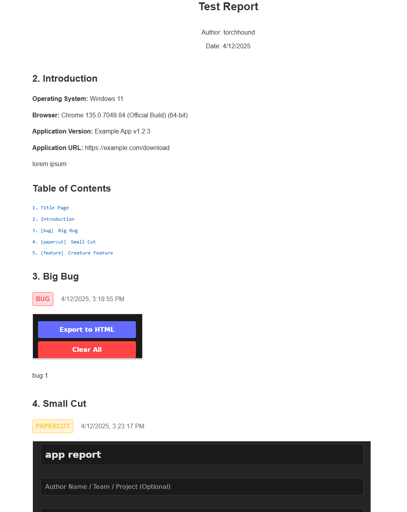

# QA Report Generator

A desktop application for creating QA reports with screenshots, detailed entry tracking, and flexible export options. Built with Tauri, React, and TypeScript for cross-platform support on Windows and Linux.



## Features

- **Title Page**: Create a title page with report title, author name, and date
- **Introduction Page**: Document system information including OS, browser, application version, and URL
- **Report Entries**: Add detailed entries with:
  - Screenshots (upload from file)
  - Classification (bug, papercut, feature) with color coding
  - Title and description
  - Drag-and-drop reordering
- **Export Options**: Generate professional HTML reports with clickable table of contents
- **Keyboard Shortcuts**: Quick entry creation with Ctrl+Shift+S

## Getting Started

### Installation

1. Download the latest release for your platform from the [Releases](https://github.com/torchhound/qa-report-generator/releases) page
2. Install the application following the platform-specific instructions

### Usage

1. **Title Page**: Start by filling in the report title, optional author name, and date
2. **Introduction**: Navigate to the Introduction tab to document system information and provide context
3. **Report Entries**: 
   - Click "Add New Entry" to create a new report item
   - Upload a screenshot (optional)
   - Select the appropriate classification (bug, papercut, feature)
   - Add a descriptive title and detailed description
   - Reorder entries by dragging the handle (☰) on the left side
4. **Export**: Use the Export to HTML button in the sidebar to generate a report

### Keyboard Shortcuts

- **Ctrl+Shift+S**: Quickly add a new entry

## Development

### Prerequisites

- Node.js (v16 or later)
- Rust (latest stable)
- System dependencies for Tauri

### Setup

```bash
# Clone the repository
git clone https://github.com/torchhound/qa-report-generator.git
cd qa-report-generator

# Install dependencies
npm install

# Run in development mode
npm run tauri dev

# Build for production
npm run tauri build
```